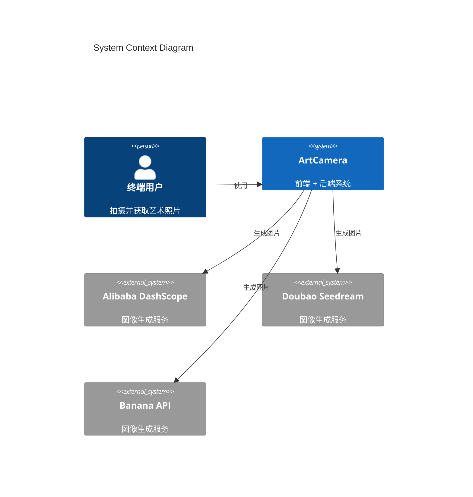
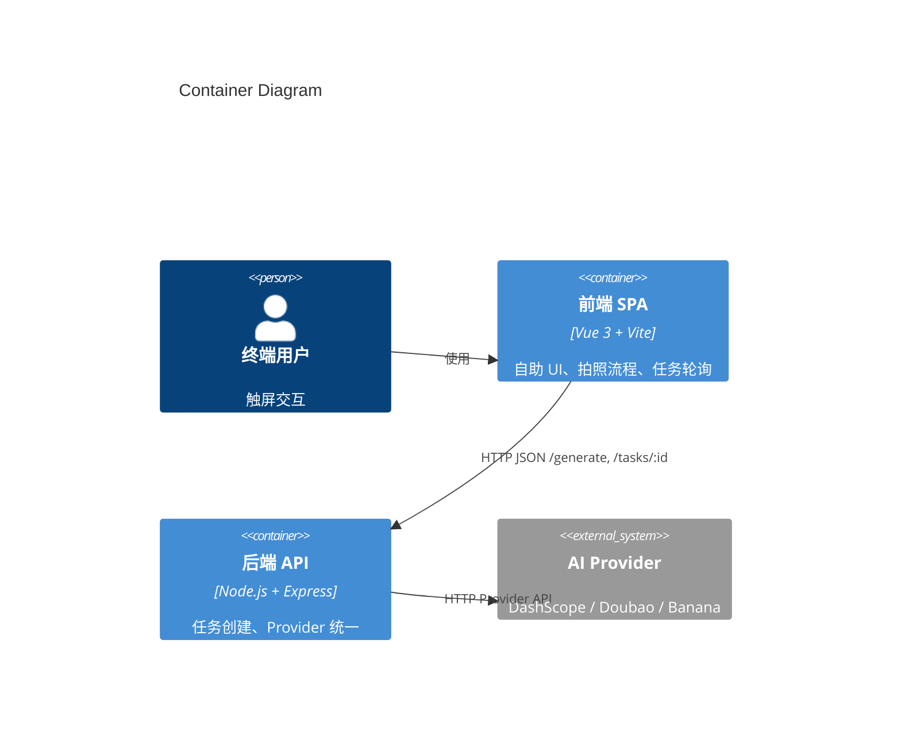

# 架构概览

## 系统上下文（C4 Level 1）

ArtCamera 是一个供终端用户使用的系统，图像生成由外部 AI 服务完成。

## 容器架构（C4 Level 2）

系统由浏览器中的前端与 Node.js 后端组成，前端通过 REST 调用后端，后端调用第三方 AI 接口。

## 关键组件

- 前端路由：`artcamera_front/src/router/index.js`
- 前端页面：`artcamera_front/src/pages/*.vue`
- 前端 AI 配置：`artcamera_front/src/config/ai.js`
- 后端 API 与 Provider：`artcamera_backend/index.js`

## 数据流概览

1. 用户在前端选择风格
2. 用户拍照，图片与风格存入 sessionStorage
3. 前端调用 POST `/generate` 创建任务
4. 后端转发至指定 Provider
5. 前端轮询 GET `/tasks/:id`
6. 成功后展示结果并生成二维码
