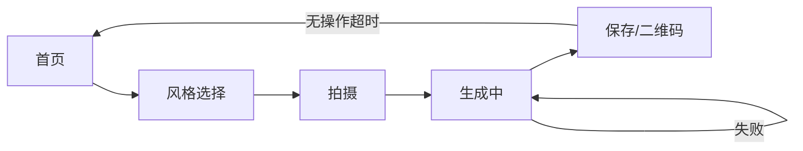
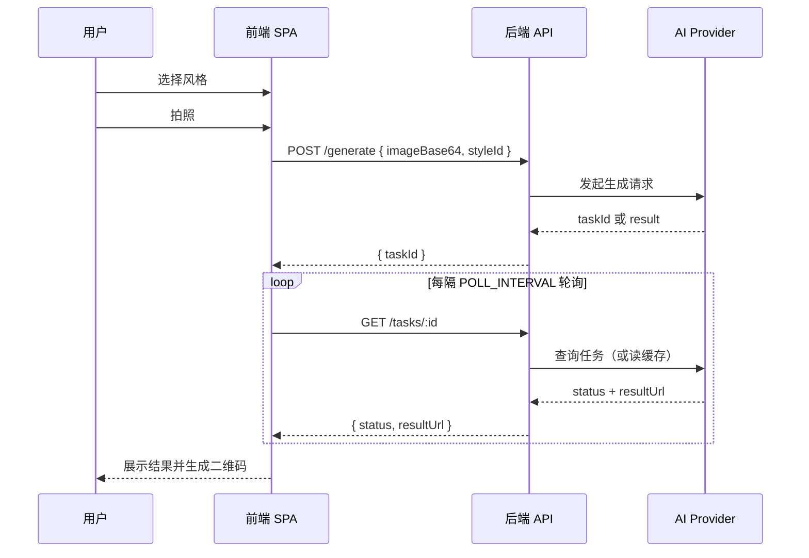

# 流程概览

## 用户流程

## 生成流程（时序）

## 异常与恢复

- 摄像头不可用时：展示遮罩与重试按钮
- 生成失败时：进入失败状态并允许重新生成
- 保存页无操作 60 秒：自动返回首页

## 状态传递

- `sessionStorage` 保存 `styleId`、`imageBase64`、`resultUrl`
- 同步 Provider 使用内存缓存为轮询提供结果
